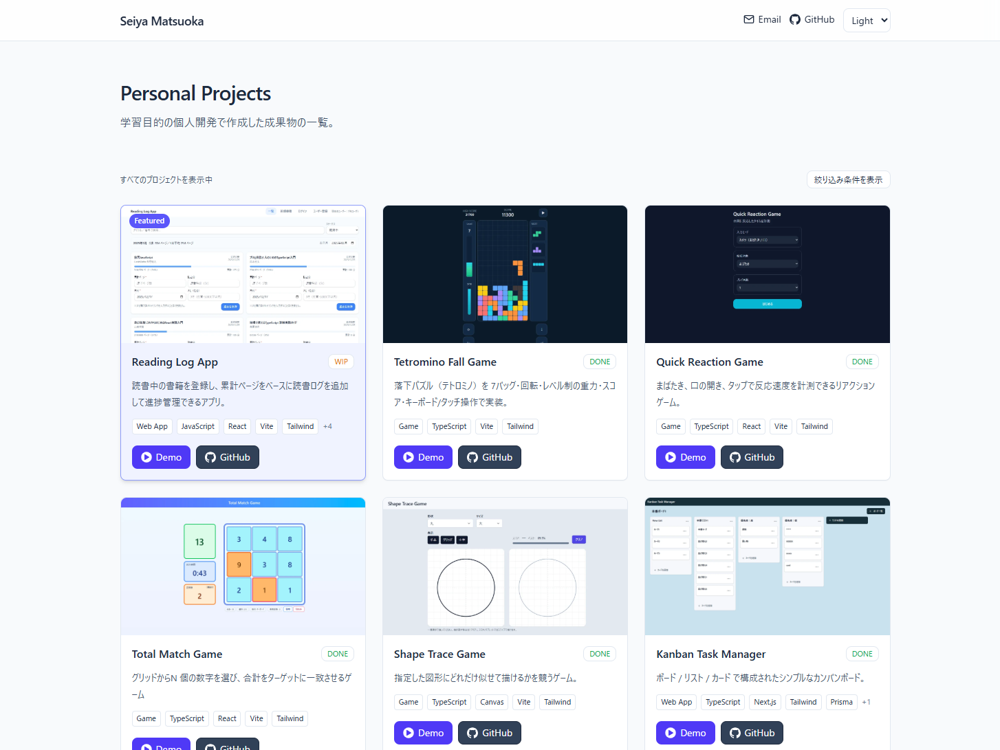
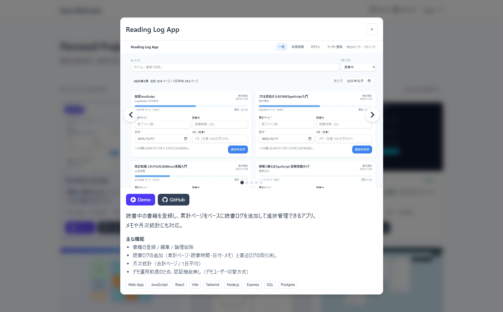
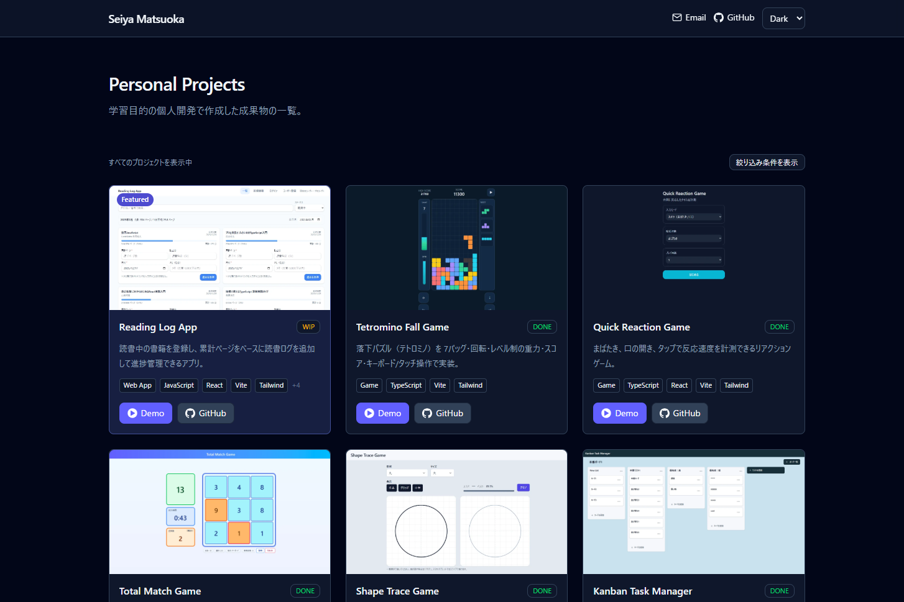

# Seiya Matsuoka – Portfolio

<p>
  <a href="https://seiya-matsuoka-dev.vercel.app/">
    
  </a>
</p>

<p>
  
  
  
  
  
</p>

学習目的の個人開発で作成した成果物をまとめて紹介するポートフォリオサイトです。  
プロジェクト情報は `src/data/projects.ts` でデータ管理し、カード一覧＋詳細モーダルで閲覧できます。

---

## 公開URL

[](https://seiya-matsuoka-dev.vercel.app/)

- [`ポートフォリオサイトURL`](https://seiya-matsuoka-dev.vercel.app/)（Vercel）：`https://seiya-matsuoka-dev.vercel.app/`

---

## スクリーンショット

1. プロジェクト一覧画面
   

2. 詳細モーダル表示
   

3. ダークモード表示
   

---

## 主な機能

- **プロジェクト一覧**
  - Status（DONE / WIP）と Kind（Game / Web App / Tool）で絞り込み
  - 「注目（featured）」プロジェクトの強調表示（バッジ / 見た目 / 並び順）
- **URL共有（状態をURLに反映）**
  - フィルタ条件をURLに反映
  - `?p=<slug>` でモーダル直リンク
- **詳細モーダル**
  - 画像ギャラリー（矢印コントロール + スワイプ操作）
  - 見切れないようにスクロール可能
  - キーボード操作
- **テーマ**
  - Light / Dark / Auto

---

## 技術スタック

- TypeScript / React / Vite
- Tailwind CSS v4
- react-icons（アイコン）

---

## ディレクトリ構成（抜粋）

```txt
src/
  components/
    Filters.tsx
    Header.tsx
    ProjectCard.tsx
    ProjectModal.tsx
    ThemeControls.tsx
  data/
    projects.ts
  lib/
    asset.ts
    theme.ts
  App.tsx
  index.css
  main.tsx
public/
  images/
    projects/
      <slug>/
        thumb.webp
        01.webp
        02.webp
index.html
```

---

## セットアップ

```bash
npm i
npm run dev
```

- `dev`：開発サーバ
- `build`：本番ビルド
- `preview`：プレビュー

---
