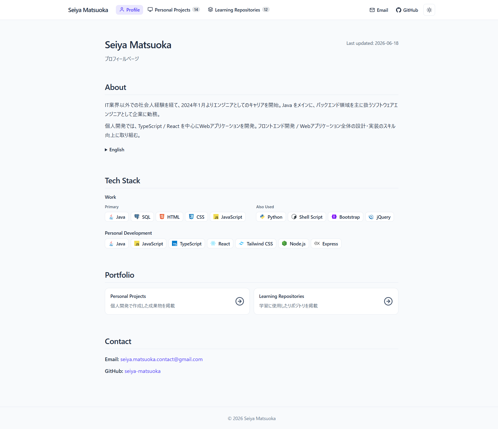
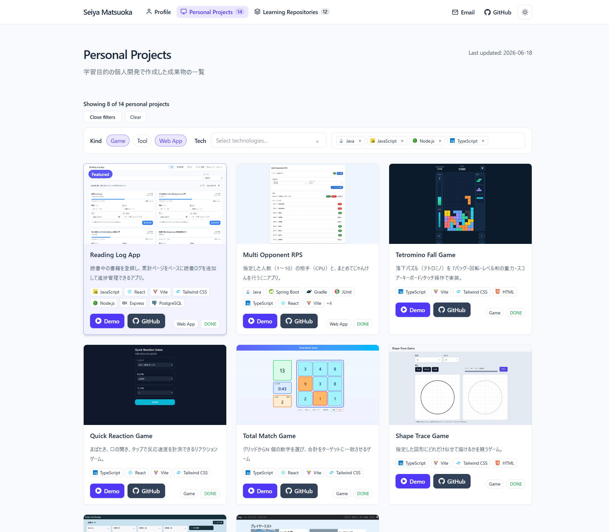
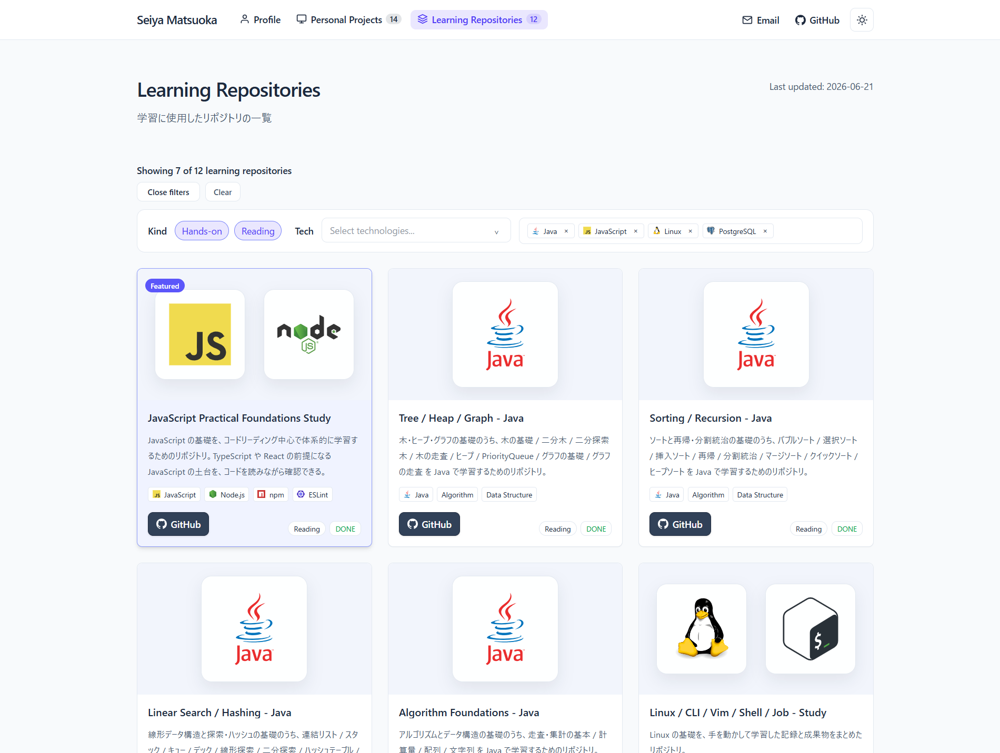
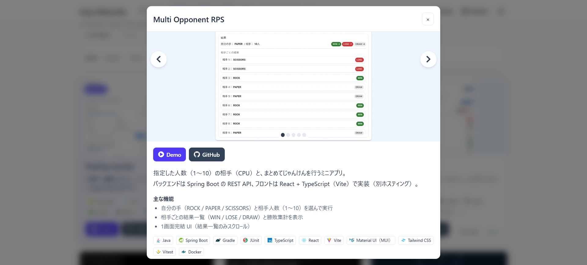
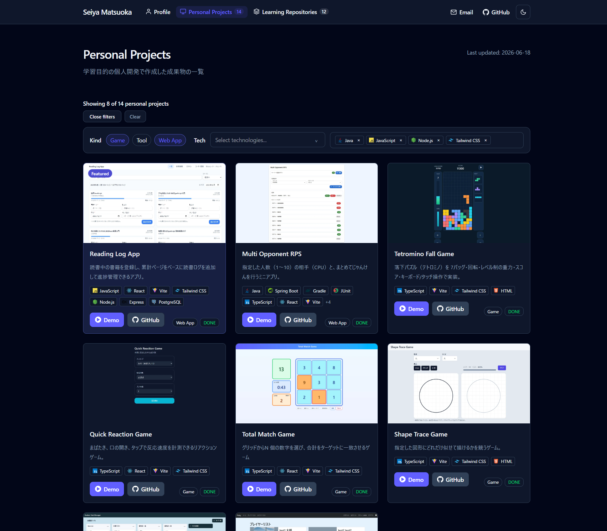

# Seiya Matsuoka – Portfolio

<p>
  <a href="https://seiya-matsuoka-dev.vercel.app/">
    
  </a>
</p>

<p>
  
  
  
  
  
</p>

プロフィール、個人開発で作成した Webアプリケーション / ツール、学習に使用したリポジトリを紹介するポートフォリオサイト。  
React / TypeScript / Vite / Tailwind CSS v4 を使用し、プロフィールページ、個人開発一覧、学習リポジトリ一覧を1つのサイトとして管理する。

---

## 公開URL

[](https://seiya-matsuoka-dev.vercel.app/)

- [`ポートフォリオサイトURL`](https://seiya-matsuoka-dev.vercel.app/)（Vercel）：`https://seiya-matsuoka-dev.vercel.app/`

---

## スクリーンショット

1. プロフィール画面
   

2. 個人開発一覧画面
   

3. 学習リポジトリ一覧画面
   

4. 詳細モーダル表示
   

5. ダークモード表示
   

---

## 掲載内容

- **Profile**
  - エンジニアとしての概要、使用技術、ポートフォリオ内コンテンツへの導線、連絡先を掲載
- **Personal Projects**
  - 個人開発で作成した Webアプリケーション / ツールを掲載
  - カード一覧、フィルタ、詳細モーダル、GitHub / デプロイ先へのリンクを提供
- **Learning Repositories**
  - 学習に使用したリポジトリを掲載
  - 使用技術、学習範囲、主な学習内容、GitHubリポジトリへのリンクを提供

---

## 主な実装内容

- React Router によるページ分割
- Profile / Personal Projects / Learning Repositories / 404ページの構成
- Personal Projects / Learning Repositories のカード一覧と詳細モーダル
- URL クエリによるフィルタ条件・モーダル直リンクの共有
- Light / Dark / System のテーマ切り替え
- レスポンシブ対応の Header / ナビゲーション

---

## 技術スタック

- TypeScript / React / Vite
- Tailwind CSS v4
- React Router
- react-icons

---

## ディレクトリ構成（抜粋）

```txt
src/
  components/
    common/
    Header.tsx
    ThemeControls.tsx
  data/
    profile.ts
    personalProjects.ts
    learningRepositories.ts
  features/
    personal-projects/
    learning-repositories/
  layouts/
    AppLayout.tsx
  lib/
    asset.ts
    theme.ts
  pages/
    ProfilePage.tsx
    PersonalProjectsPage.tsx
    LearningRepositoriesPage.tsx
    NotFoundPage.tsx
  App.tsx
  index.css
  main.tsx
public/
  images/
    projects/
      <slug>/
        thumb.webp
        01.webp
        02.webp
  icons/
    learning-repositories/
      *.svg
index.html
```

---

## セットアップ

```bash
npm i
npm run dev
```

- `dev`：開発サーバ
- `build`：本番ビルド
- `preview`：ビルド結果のプレビュー

---

## 環境変数

- `VITE_SITE_URL`：サイトのベースURL（例：`https://seiya-matsuoka-dev.vercel.app`）

> Vercel では Environment Variables に設定。

---

## 使用素材・ライセンス

- 学習リポジトリ一覧の技術アイコンには Devicon の SVG を使用
- Devicon のライセンス情報は `public/icons/learning-repositories/README.md` と `public/icons/learning-repositories/DEVICON_LICENSE.txt` に記載
- プロダクト名、ロゴ、ブランドは各所有者に帰属

---

## デプロイ

- Vercel にデプロイ
- 環境変数 `VITE_SITE_URL` を設定してビルド
- SPA ルーティング用の rewrites を `vercel.json` で管理
